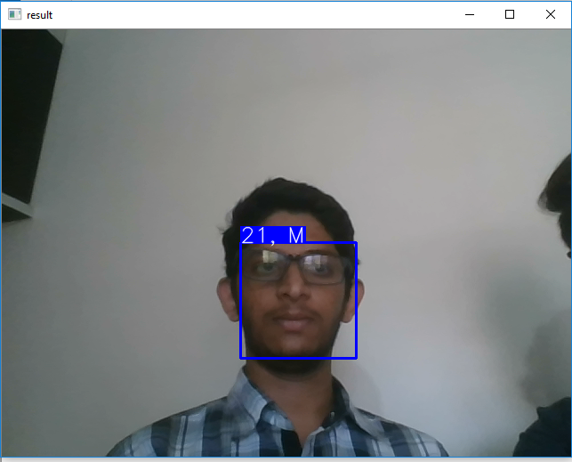

# AgeClassificationUsingFacialImage

Age and gender play a significant role in someone’s identification and are helpful to provide access to the contents on application or websites which have content not allowed for under certain Age. These services try to identify the true identity of the user by verifying age at the point of registration or providing bank account details. But, the existing methods do not achieve the purpose of the existing web services offered. In such methods, picture frame is taken as input and by processing, expected predictions will be given as output. For age and gender predictions, many algorithms use classification and machine learning concepts. Most primitive kind of algorithms are used to derive several secondary algorithms with enhancements. A couple of primitive algorithms are “Eigen Faces” and “Fisher Faces”.  Deep Convolutional Neural Networks (CNN) is another technique used.

Older methods of face recognition were dependent on ratios of the face. Each face image was profiled for the facial features and their ratios were calculated to find the age of the person in the image. The hypothesis like the accuracy of classification over the age gets lesser within the age group of sixteen to twenty two [16-22] years. By training a huge set of images to the models may overcome this. The input image has to have minimum noise and captured with exposure to light, the photographs without brightness cannot be classified at higher accuracy.

In this project, we use IMDB and WIKI datasets which have more than 5 lakh face images. The date of birth of those people in the image and the date the image captured are mentioned as the name of the image. Using this the age of the person in the image is calculated. First, we divide the data set into training and testing sets. In the training set, we crop the face in the image using Matlab and train the model using deep neural networks for 30 epochs. This yields a machine learning model which takes a new image as the input and produces the age of the person in the output. This model is then converted into a TensorFlow lite model which is used in our android application. This application is used to restrict children from viewing the content on the internet that are not intended to them.

This project is aimed towards restricting children from mature and unintended content on the internet and providing a means of authentication of age in online platforms. If the user is found to be a child from the model then the website or the content can be hidden or restricted to the user and asked for parental assistance. Since there is no effective method to do so currently, this project can provide a means by which age restrictions can be made possible.

System Design

This system is made up of two parts, the trained model and the android application.
By training all the images available in the IMDB Dataset, a trained model is created using Keras, which is used to determine the age of the person in the image. This model is converted into a Tensorflow Lite model which is compatible with the android application.
The android application is used to capture the photo of the user, crop the face and send it to the Tensorflow Lite model. This model classifies the face in the image as an adult or a child. If the image is classified as a child, access to that application is denied.

     
     
System Requirement:

4.1 Software Requirements:
•	Python3.5+
•	Keras2.0+
•	scipy, numpy, Pandas, tqdm, tables, h5py
•	dlib (for demo)
•	OpenCV3
•	Android Studio

4.2 Hardware Requirements:
•	Ubuntu 16.04,Windows 10,  Python 3.5.2, Keras 2.0.3, Tensorflow(-gpu) 1.0.1, 
Theano 0.9.0, CUDA 8.0, cuDNN 5.0
•	CPU: i7-7700 3.60GHz, GPU: GeForce GTX1050Ti
•	macOS Sierra, Python 3.6.0, Keras 2.0.2, Tensorflow 1.0.0, Theano 0.9.0
•	Android Mobile version Above 5.0 (lollipop)  

Applications:
1.	ACUN(Age Classifier using CNN) app: Android application:
This application deals with providing security to children (aged under 18) to not get affected by contents over some application which needs age verification before use.
2.	Gaming applications like PUBG, Fortnite, GTA and many games have their own age restrictions and in this case our application comes in handy.
3.	Places that allow only adults like bars and pubs can use this to classify adults.
4.	Many webpages grant access based on the person’s age, this method can be used to verify their age
5.	Streaming applications like Twitch need to have the age verified from the user before access.

Demo of Android App in use:

Demo of Background process:

